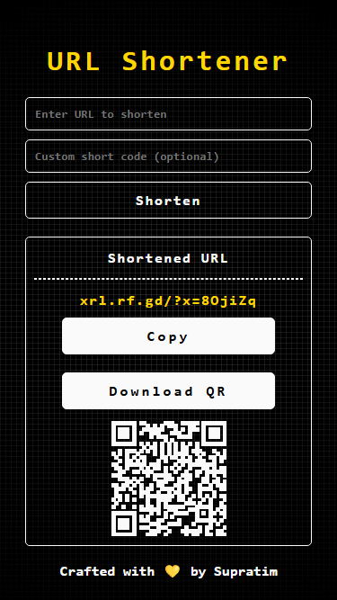
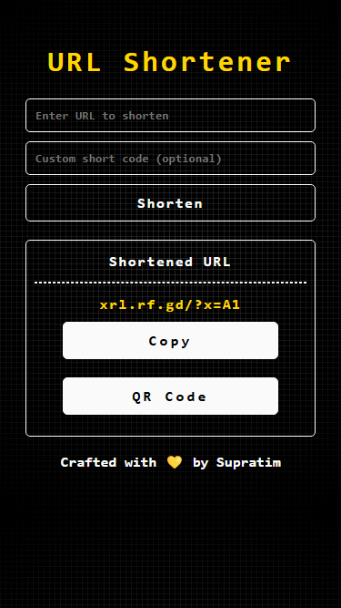

# 🌐 URL Shortener  

A **modern and scalable** URL shortener application built with **PHP** and **MySQL**. This web app lets you shorten long URLs into compact, custom short codes and retrieve the original links seamlessly. Perfect for both personal use and production-scale deployment!  

---

## 🚀 Features  

- ✂️ **Shorten Long URLs**  
  Convert lengthy URLs into concise, easy-to-share short codes.  
- 🎨 **Custom Short Codes**  
  Personalize your short codes for brand recognition.  
- 🔗 **Seamless Redirection**  
  Automatically redirect users from short codes to original URLs.  
- 🔍 **Duplicate Detection**  
  Checks if a URL has already been shortened.  

---

## 📋 Prerequisites  

- 🖥️ **PHP** (>= 7.0)  
- 🗄️ **MySQL** or **MariaDB**  
- 🌐 **Web Server** (e.g., Apache)  
- 📦 **Composer** (for dependency management)  

---

## ⚙️ Installation  

### 1️⃣ Clone the Repository  

```bash  
git clone https://github.com/SupratimRK/url-shortener.git  
cd url-shortener  
```  

### 2️⃣ Set Up the Database  

1. **Create the database:**  

```sql  
CREATE DATABASE url_shortener;  
```  

2. **Create the table:**  

```sql  
USE url_shortener;  

CREATE TABLE urls (  
    id INT AUTO_INCREMENT PRIMARY KEY,  
    original_url VARCHAR(255) NOT NULL,  
    short_code VARCHAR(10) NOT NULL UNIQUE  
);  
```  

3. **(Optional) Insert sample data:**  

```sql  
INSERT INTO urls (original_url, short_code) VALUES  
('https://www.example.com', 'exmpl'),  
('https://www.anotherexample.com', 'anothr');  
```  

---

### 3️⃣ Configure the Application  

1. **Create a `config.php` file in the root directory:**  

```php  
<?php  
// MySQL connection parameters  
$servername = "yourhost";  
$username = "yourusername";  
$password = "yourpassword";  
$database = "url_shortener";  

$conn = new mysqli($servername, $username, $password, $database);  

if ($conn->connect_error) {  
    die("Connection failed: " . $conn->connect_error);  
}  
?>  
```  

2. **Include `config.php` in `index.php`:**  

```php  
<?php  
include 'config.php';  
// ... rest of the code  
?>  
```  

---

### 4️⃣ Set Up the Web Server  

1. **Apache Configuration:**  

```apache  
<VirtualHost *:80>  
    ServerAdmin webmaster@localhost  
    DocumentRoot "path_to_your_project_directory"  
    ServerName url-shortener.local  

    <Directory "path_to_your_project_directory">  
        Options Indexes FollowSymLinks  
        AllowOverride All  
        Require all granted  
    </Directory>  

    ErrorLog ${APACHE_LOG_DIR}/error.log  
    CustomLog ${APACHE_LOG_DIR}/access.log combined  
</VirtualHost>  
```  

2. **Update Hosts File:**  

```plaintext  
127.0.0.1 url-shortener.local  
```  

3. **Restart Apache:**  

```bash  
sudo service apache2 restart  
```  

---

### 5️⃣ Access the Application  

🌐 Open your browser and visit: **`http://url-shortener.local`**  

---

## 🎉 Usage  

1. **Shorten a URL:**  
   - Enter your URL in the input field.  
   - (Optional) Add a custom short code.  
   - Hit the "Shorten" button.  

2. **Retrieve the Original URL:**  
   - Access the short code in your browser (e.g., `http://url-shortener.local?x=shortcode`).  
   - The app redirects to the original URL if the code exists.  

---
## 📸 Screenshot of the App

Here is a screenshot of the URL shortener in action:




---
## 📜 License  

🔓 This project is licensed under the **MIT License**. Check the [LICENSE](LICENSE) file for details.  

---

## 🤝 Contributing  

We welcome contributions! Whether it's bug fixes, feature enhancements, or new ideas, feel free to:  
- 🛠️ Submit a Pull Request  
- 🐛 Open an Issue  

Let’s make this project even better together!  

---

## 📧 Contact  

For inquiries, feedback, or support, reach out to **[supratimrk@outlook.com](mailto:supratimrk@outlook.com)**.  

---

💡 **Demo the Application Now:**  
- **🌍 Production:** [demo.com](http://demo.com)  
- **⚙️ Development:** [demo2.com](http://demo2.com)  

**Visit and explore the app live:** [xrl.rf.gd](https://xrl.rf.gd/)  

---

⭐ **Don’t forget to give a star on GitHub if you like it!**  
Let me know your thoughts, and feel free to fork the repo for your custom needs! 😊  